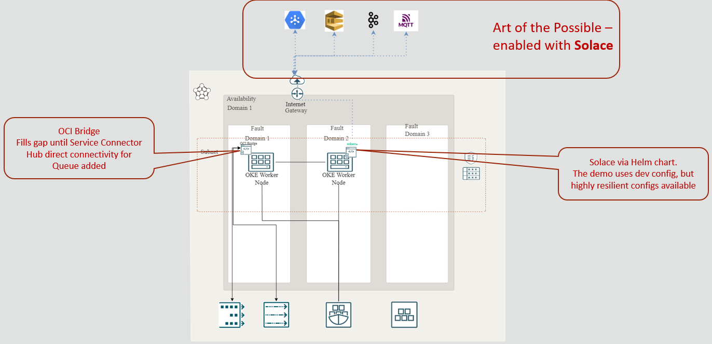

# oci-bridge

## Introduction

This is a simple tool intended to help bridge event sources and destinations where there isn't a natural connection deployment already available within OCI.  It has been initially developed to support connecting [OCI Queues](https://www.oracle.com/cloud/queue/), [OCI Streaming](https://www.oracle.com/cloud/streaming/) (using Kafka protocol), and with [Solace](https://solace.com/) [PubSub+](https://solace.com/products/event-broker/software/) but creating new sources or destinations is straightforward. As the connections simply need to extend an abstract class (additionally, a factory method needs to be extended until the factory process is refactored to use reflection.) The implementation uses [Maven](https://maven.apache.org/) to build the code and can work with Java 11 or later.

# Getting Started

The details for configuring the bridge can be found in the docs [here](./docs/bridge-configuration.md).

The bridge can be run locally or within OCI.  We have included resources in the /deploy folder to enable the bridge to be deployed in [Container Engine for Kubernetes](https://www.oracle.com/uk/cloud/cloud-native/container-engine-kubernetes/) (or any other Kubernetes environment).

This solution assumes that you will have created the relevant services and policies.  If you wish to demo with OCI Solace (the original motivation for the utility), then we would recommend following [these details](./docs/deploying-Solace) for deploying Solace PubSub+ on OCI.

An example demo deployment:

# Configuring the bridge

The bridge can be configured in a number of ways. The details of the bridge configuration itself are covered [here](./docs/bridge-configuration.md).

# Contributing

This project is open source. Please submit your contributions by forking this repository and submitting a pull request! Oracle appreciates any contributions that are made by the open-source community.

## License

Copyright (c) 2022 Oracle and/or its affiliates.

Licensed under the Universal Permissive License (UPL), Version 1.0.

See [LICENSE](https://github.com/oracle-devrel/terraform-oci-arch-tags/blob/main/LICENSE) for more details.

ORACLE AND ITS AFFILIATES DO NOT PROVIDE ANY WARRANTY WHATSOEVER, EXPRESS OR IMPLIED, FOR ANY SOFTWARE, MATERIAL OR CONTENT OF ANY KIND CONTAINED OR PRODUCED WITHIN THIS REPOSITORY, AND IN PARTICULAR SPECIFICALLY DISCLAIM ANY AND ALL IMPLIED WARRANTIES OF TITLE, NON-INFRINGEMENT, MERCHANTABILITY, AND FITNESS FOR A PARTICULAR PURPOSE. FURTHERMORE, ORACLE AND ITS AFFILIATES DO NOT REPRESENT THAT ANY CUSTOMARY SECURITY REVIEW HAS BEEN PERFORMED WITH RESPECT TO ANY SOFTWARE, MATERIAL OR CONTENT CONTAINED OR PRODUCED WITHIN THIS REPOSITORY. IN ADDITION, AND WITHOUT LIMITING THE FOREGOING, THIRD PARTIES MAY HAVE POSTED SOFTWARE, MATERIAL OR CONTENT TO THIS REPOSITORY WITHOUT ANY REVIEW. USE AT YOUR OWN RISK.
