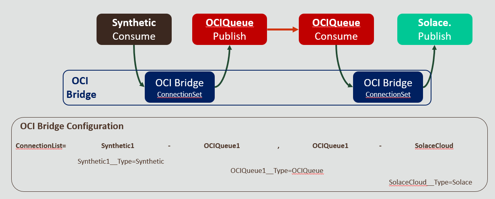

# Bridge Configuration Properties

The OCI Bridge code is driven through configuration properties which can be set via:

- Environment variables
- A properties file

Environment variables will always take precedence over the properties file if a property file is duplicated. This approach means we can define common generic configurations and then modify them with specific use case attributes such as credentials or the OCID of a Queue. As the values come from environment properties, it makes it easy to define these controls using Kubernetes config maps, which in turn means we can pull values from Kubernetes secrets as needed. 

Given this model, we have provided several properties files ([/config](../config)) and configmap examples ([/deploy](../deploy)). Where OCIDs or credentials may be involved, the examples have gummy values.

There are two types of properties:

- Core control properties - these define the bridge behavior, for example, `ListConnectionProperties=Synthetic1-Synthetic2`
- Connection properties - these describe the attribute values for a specifically named connection. These can be recognized as they start with the connection name followed by __ (2 underscores) and then the attribute name.  For example, `Synthetic1__Type=Synthetic` defines the connection type for a connection called Synthetic1.

The properties are case-sensitive.

### Properties

#### Core

| Env Var Name          | Description                                                  | Example Value                             |
| --------------------- | ------------------------------------------------------------ | ----------------------------------------- |
| isMultiPass           | Tells the tool whether to make a single pass through all the connections of all of them and repeat. Setting this value to False will mean all the connections will be exercised, but only once - ideal for testing the configuration. | True                                      |
| milliDelayOnMultiPass | To avoid the thrashing of resources, we include the option to delay between passing through each of the connection pairs. This needs to be an integer value. If the value is not set, then it is defaulted to 0, which means no pause. Start the next pass | 1000                                      |
| ListConnectorProps    | This is a boolean option that offers provides the possibility for the different connectors to output the known properties for each connector type. The information is printed using the logging framework configured. By default, this is false. | true                                      |
| ConnectionList        | This defines the connections - expressed as pairs. Each pair is comma separated, and within a pair, the source of the message and destination of the message are separated by a dash. The name used is the prefix name used for the subsequent properties. | Synthetic!-MyOCIQueue, MyOCIQueue-aSolace |

The connections and the follow of messages between the different connectors is illustrated in the following diagram:

##### Common Connection Attributes

All the connections have a common set of properties, as defined in the following table.

| Env Var Name | Description                                                  | Example Value |
| ------------ | ------------------------------------------------------------ | ------------- |
| Type         | Defines the connection type that is being represented, Currently accepted values are: *Synthetic*, *Solace*, *OCIQUEUE*. Each type of connection must have a unique type name. | Synthetic     |
| pass_all     | Boolean indicarting whether the properties should be filtered down to the known set of expected values, or pass all properties that carry the prefix. Looking just for the predefined and expected properties is more efficient (and safer) but if custom attributes need to be mapped dynamically (for example with Solace - this option can be set) | true          |

#### OCI Queue

OCI Queue can have the necessary credentials provided in several ways depending upon configuration preference and whether the deployment of the bridge is within OCI (in which case an [Instance Principles](https://docs.oracle.com/en-us/iaas/Content/Identity/Tasks/callingservicesfrominstances.htm) configuration is used) or outside, in which case an *authfile* with the necessary properties can be provided or the properties individually supplied (allowing values to be set/overridden.) Details on getting credentials can be found [here](https://docs.oracle.com/en-us/iaas/Content/API/Concepts/apisigningkey.htm).

The [OCI Queue](https://docs.oracle.com/en-us/iaas/Content/queue/overview.htm) documentation can be found here.

| Env Var Name     | Description                                                  | Example Value                                       |
| ---------------- | ------------------------------------------------------------ | --------------------------------------------------- |
| OCI_AUTHFILE     | Provides the location of the authentication properties file within the environment can be absolute or relative to the point of execution. | oci.properties                                      |
| OCI_USERID       | The OCID of the User to be used as the connecting identity.  | ocid1.user.oc1..aaaabbbbbcccccddddddeeefffggghh     |
| OCI_TENANT_ID    | The OCID for the tenancy (how to get this is described [here](https://docs.oracle.com/en-us/iaas/Content/GSG/Tasks/contactingsupport_topic-Finding_Your_Tenancy_OCID_Oracle_Cloud_Identifier.htm)). | ocid1.tenancy.oc1..aaaabbbbbcccccddddddeeefffggghh  |
| OCI_FINGERPRINT  | The credentials fingerprint                                  | 11:22:33:44:55:66:77:88:aa:bb:cc:dd:ee:a1:b2:c3     |
| OCI_REGION       | The region identifier of the OCI Region in which the OCI Service is instantiated in  e.g. *ap-sydney-1* (the full list is [here](https://docs.oracle.com/en-us/iaas/Content/General/Concepts/regions.htm)). | us-ashburn-1                                        |
| OCI_QUEUEID      | The OCID of the Queue                                        | ocid1.queue.oc1.iad.aaaabbbbbcccccddddddeeefffggghh |
| POLLDURATIONSECS | As OCI Queue supports long polling, we can stipulate the poll duration in seconds. | 20                                                  |
| QUEUENAME        | The name of the Queue - this provides a convenient handle in the logging. | myQueue                                             |

#### Solace Pub/Sub+

Where ever possible, we try to propagate the Solace configuration values through to Solace Pub/Sub+. However, there are a couple of constraints.

- Solace uses a dot notation within some of its properties. As this can present issues with some OSes for environment variables, we have implemented a substitution mechanism. So within the Solace variable names, if a dot (.) is used, then for the environment variables, replace it with an underscore  (_)

| Env Var Name                           | Description                                                  | Example Value               |
| -------------------------------------- | ------------------------------------------------------------ | --------------------------- |
| SOLACE_PORT                            | Network port to communicate with. This depends on the protocol being used and the server configuration. Although the server has default ports for the different protocols supported. The bridge interacts using its REST interface | 55554                       |
| host                                   | The Host address with the protocol prefix to be included     | tcp://192.168.0.1:55555     |
| MESSAGE_TYPE                           | Defines whether we're using a Queue or Topic. The expected values are *queue* or *topic* | queue                       |
| solace_messaging_authentication_scheme | The authentication scheme to use with Solace. To date only the AUTHENTICATION_SCHEME_BASIC option has been validated. Enabling the pass_all should allow all the necessary values to be passed through for alternative authentication settings. | AUTHENTICATION_SCHEME_BASIC |
| username                               | The username to provide as part of basic authentication      | admin                       |
| password                               | The password to provide as part of basic authentication      | admin                       |
| SOLACE_TOPICNAME                       | The name of the queue or topic to be connected with          | demo                        |
| vpn_name                               | The name of the [VPN](https://docs.solace.com/Features/VPN/Managing-Message-VPNs.htm) within a  Solace setup that the Queue or Topic resides. | default                     |

#### Synthetic

The synthetic connector mimics a real connector, but rather than connecting to anything will simply generate messages when requested for a message and consume any provided messages.

| Env Var Name | Description | Example Value |
| ------------ | ----------- | ------------- |
|              |             |               |

#### Kafka / OCI Streaming

The Kafka / OCI Streaming connection works by using the Kafka protocols which OCI Streaming can handle.

| Env Var Name | Description                                                  | Example Value   |
| ------------ | ------------------------------------------------------------ | --------------- |
| total_msgs   | An integer defining the number of messages that will be provided on each connector read. | 1               |
| msg_prefix   | The synthetic message is a simple text message with a counter. This attribute provides the opportunity to configure a prefix string to the message created | "my message is" |

